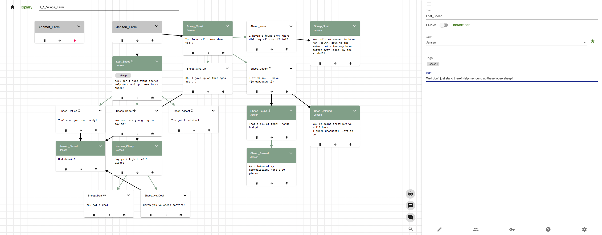

# Topiary

Dialogue Tree Editor inspired by [twinery](http://www.twinery.org) created with React.

### Installation

1.  clone repo
2.  `npm install` dependencies
3.  `npm start` to load react app.

### Dependencies

* material-ui
* file-saver
* gradstop
* prop-types
* react
* react-dom
* react-draggable
* react-redux
* react-router-dom
* react-scripts
* redux
* reselect

### To do

* [x] Create new scenes
* [x] Delete scenes
* [x] Create new nodes
* [x] Delete nodes
* [x] Place nodes
* [x] Move child nodes
* [x] Add links
* [x] Delete/Move links
* [x] Visual cues for linkable nodes
* [x] Link/marker marker colors based on actor color
* [x] Add actors
* [x] Delete actors
* [x] Set default actor
* [ ] Actor Avatars?
* [ ] Global/Scene Actors
* [x] Actor colours
* [ ] Custom Actor Variables
* [ ] Factions
* [x] Variables
* [ ] Variable unique key values
* [x] Conditions and Effects
* [x] Autocomplete variable selection
* [x] Tooltips
* [x] Collapsable tree segments (needs improvement)
* [ ] Zoom functionality
* [ ] Settings and Help tabs
* [x] Search funcationality (needs better visual cues)
* [x] Persistent State
* [x] Load/Save files
* [ ] Playthrough
* [ ] Text Editor?
